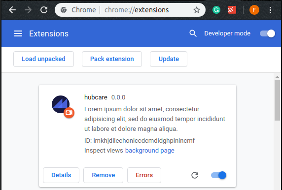

# hubcare

[](https://gitlab.com/cjjcastro/2019-1-hubcare-plugin/pipelines)
[](https://codecov.io/gh/fga-eps-mds/2019.1-hubcare-plugin)
[](https://codeclimate.com/github/fga-eps-mds/2019.1-hubcare-plugin/maintainability)
[](https://david-dm.org/fga-eps-mds/2019.1-hubcare-plugin)
[](https://david-dm.org/fga-eps-mds/2019.1-hubcare-plugin?type=dev)
[](https://opensource.org/licenses/MIT)
[](http://isitmaintained.com/project/fga-eps-mds/2019.1-hubcare-plugin "Average time to resolve an issue")
[](http://isitmaintained.com/project/fga-eps-mds/2019.1-hubcare-plugin "Percentage of issues still open")

The Hubcare is an open-source project intended to help free software users and potential contributors to decide which repositories they should use or on which they should contribute. It has an [API](https://github.com/fga-eps-mds/2019.1-hubcare-api) that pulls data from GitHub API and post it to this Add-on. Any more details about project may be found on [Documentation](https://cjjcastro.gitlab.io/2019-1-hubcare-docs/), which is mostly in Portuguese, due to Brazilian project stakeholders.

This repository, in special, is fully dedicated to the maintain Add-on details. Feel free to read, run and contribute.

## Technologies


## Installation

### Installing from Chrome Store

Just go to HubCare's page on [Chrome Store](https://chrome.google.com/webstore/detail/hubcare/oilkenamijbelpchecmfpllponcmlcbm) and be happy :wink:

### Running things locally

Wanna see it working on your machine, uh?

Unfortunately, the Add-on code wasn't made for local interaction, you may want to up the API on some deploy service to see it working. But you can still run the API and the Add-On separately if you want.

You'll need have [Docker](https://docs.docker.com/install/) and [Docker-Compose](https://docs.docker.com/compose/install/) installed to see the magic happenning.

And I just know how to do it on a Linux machine. C'mon, Windows is just for gaming, y'know. And MacOS users surely can pay someone to discover how to do it.

#### Running the API

Downloading

```bash
cd ~/your/directory/
git clone https://github.com/fga-eps-mds/2019.1-hubcare-api.git
cd 2019.1-hubcare-api
```

The HubCare API need to send a GitHub username and an API token to authenticate on GitHub API. This is set by environment variables as shown below. You can generate tokens [here](https://github.com/settings/tokens).

```bash
export NAME='username'
export TOKEN='token'
```

There you go!

```bash
docker-compose build
docker-compose up
```

If everything was done right, you now have the HubCare running on your machine. Just navigate to `0.0.0.0:8000` and you should see something. There are services running on ports [8000..8003].

Test it on http://0.0.0.0:8000/hubcare_indicators/fga-eps-mds/2019.1-hubcare-api

**Obs:** If you ever need to change the values of `NAME` or `TOKEN`, rerun `docker-compose build`. Those variables are got in build time.

#### Run the Add-on

Downloading

```bash
cd ~/your/directory/
git clone https://github.com/fga-eps-mds/2019.1-hubcare-plugin.git
cd 2019.1-hubcare-plugin
```

Building and uping things:

```bash
docker-compose build
docker-compose up
```

This should be enough to turn the service on ( ͡° ͜ʖ ͡°).

Now, exists a `dist/chrome` directory with all things Chrome needs to execute the Add-on.

> Obs: port 35729 must be free to connect to Chrome

Then, open Google Chrome on [chrome://extensions/](chrome://extensions/), activate `Developer mode` on top right corner. Some new options will appear, click on `Load unpacked` e open the generated `2019.1-hubcare-plugin/dist/chrome` directory.



You now shoud see hubcare extension, just activate it.

Just go to some GitHub repo to see it working. I recommend [this one](https://github.com/fga-eps-mds/2019.1-hubcare-api), you can even give it a star! :star: :wink:

##### Execute others commands 

If you want to execute commands inside your docker container, use:

```shell
$ docker-compose exec hubcareplugin <command>
```
example:
```shell
$ docker compose exec hubcareplugin npm install
```

The Add-on uses Node, so npm commands can be used. To install dependencies:

```shell
$ npm install
```

Although this software only focuses the support on Google Chrome, it is possible to try it on other browsers. **We can't ensure your PC will not explode with the foward steps, good luck!**

This runs the Add-on on dev mode:

```shell
$ npm run dev chrome
$ npm run dev firefox
$ npm run dev opera
$ npm run dev edge
```

This generate a package to be published:

```shell
$ npm run build chrome
$ npm run build firefox
$ npm run build opera
$ npm run build edge
```

To run the tests:

```shell
$ npm test
``` 

### Environment

The build tool also defines a variable named `process.env.NODE_ENV` in your scripts.

## Contributing

Please make sure to read the [Contribution Guide](./.github/CONTRIBUTING.md) before making a pull request. After you've read, don't forget to take an issue!

## License

Do whatever you want with this code, bro/sis. This is under [MIT License](./LICENSE).